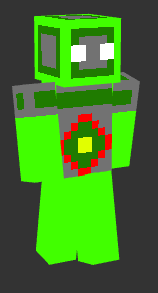

# Minecraft Skins!

This page has my minecraft skins I have made. All of these skins are free to download.

<table>
  <tr>
    <td>
      <a href="minecraft_skins/covblock_king.png" download>
         
        King Null (png, 420 bytes)
      </a>
    </td>
    <td>
      <a href="minecraft_skins/covblock_earth_element.png" download>
         
        Earth Element (png, 515 bytes)
      </a>
    </td>
    <td>
      <a href="minecraft_skins/covblock_air_element.png" download>
         
        Air Element (png, 553 bytes )
      </a>
    </td>
    <td>
      <a href="minecraft_skins/covblock_water_element.png" download>
         
        Water Element (png, 673 bytes )
      </a>
    </td>
 </td>
    <td>
      <a href="minecraft_skins/covblock_fire_element.png" download>
         
        Fire Element (png, 528 bytes )
      </a>
    </td>
    </tr>  

  <tr>
    <td>
      <a href="minecraft_skins/covblock_spy.png" download>
         
        Spy (png, 1,435 bytes)
      </a>-->
    </td>
    <td>
      <!--<a href="minecraft_skins/covblock_king.png" download>
         
        King Null (png, 420 bytes)
      </a>-->
    </td>
    <td>
      <!--<a href="minecraft_skins/covblock_king.png" download>
         
        King Null (png, 420 bytes)
      </a>-->
    </td>
    <td>
      <!--<a href="minecraft_skins/covblock_king.png" download>
         
        King Null (png, 420 bytes)
      </a>-->
    </td>
 </td>
    <td>
      <!--<a href="minecraft_skins/covblock_king.png" download>
         
        King Null (png, 420 bytes)
      </a>-->
    </td>
    </tr>  
  
</table>
